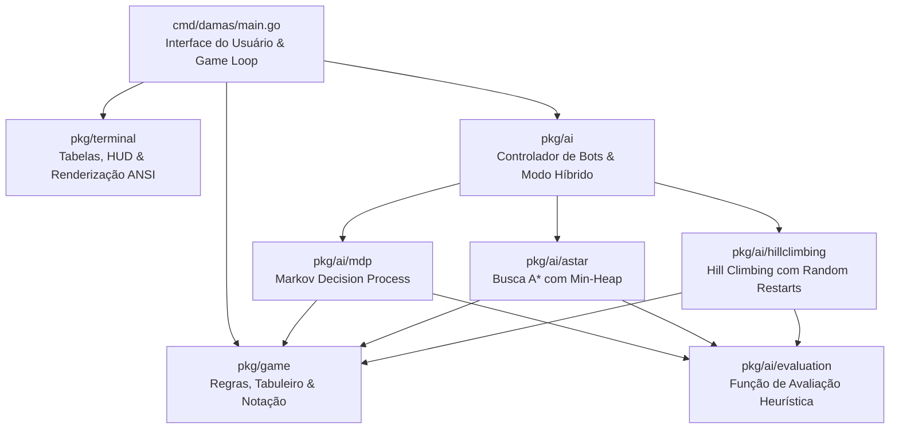

# Damas Go - Inteligência Artificial & Jogo de Damas no Terminal

[](https://golang.org)
[](https://www.docker.com)
[](https://github.com/features/codespaces)
[](tests/)

Sistema completo para jogo de Damas implementado em **Go (Golang)** puro, projetado para execução no terminal com interface rica em tabelas Unicode e suporte a múltiplos motores de **Inteligência Artificial** desenvolvidos do zero (**Processo de Decisão de Markov**, **Busca A\*** e **Hill Climbing com Reinicialização Aleatória**).

O projeto conta com arquitetura modular, **zero dependências externas**, conformidade estrita com as **Regras Brasileiras de Damas**, matriz espacial configurável (**10x10** e **8x8**) e suporte nativo a contêineres **Docker** e **GitHub Codespaces**.

---

## Sumário

- [Visão Geral da Arquitetura](#visão-geral-da-arquitetura)
- [Estrutura do Projeto](#estrutura-do-projeto)
- [Modelagem dos Algoritmos de Inteligência Artificial](#modelagem-dos-algoritmos-de-inteligência-artificial)
  - [1. Processo de Decisão de Markov (MDP)](#1-processo-de-decisão-de-markov-mdp)
  - [2. Busca A* (A-Star Tactical Search)](#2-busca-a-a-star-tactical-search)
  - [3. Hill Climbing com Reinicialização Aleatória](#3-hill-climbing-com-reinicialização-aleatória)
  - [4. Modo Híbrido Mestre](#4-modo-híbrido-mestre)
- [Ferramentas e Bibliotecas Próprias](#ferramentas-e-bibliotecas-próprias)
  - [Motor de Tabelas e Renderização de Terminal](#motor-de-tabelas-e-renderização-de-terminal)
  - [Parser de Notação Algébrica](#parser-de-notação-algébrica)
  - [Mecanismo de Validação de Regras](#mecanismo-de-validação-de-regras)
- [Instalação e Execução](#instalação-e-execução)
  - [Execução Nativa com Go](#execução-nativa-com-go)
  - [Execução via Docker no Windows (PowerShell)](#execução-via-docker-no-windows-powershell)
  - [Execução via Docker no Linux / macOS](#execução-via-docker-no-linux--macos)
  - [Execução no GitHub Codespaces](#execução-no-github-codespaces)
- [Suíte de Testes Automatizados](#suíte-de-testes-automatizados)

---

## Visão Geral da Arquitetura

O projeto adota uma arquitetura em camadas com separação clara de responsabilidades:



---

## Estrutura do Projeto

```
Damas_Go/
├── .devcontainer/
│   └── devcontainer.json        # Configuração oficial para GitHub Codespaces
├── cmd/
│   └── damas/
│       └── main.go              # Ponto de entrada, menus interativos e loop do jogo
├── pkg/
│   ├── game/                    # Núcleo de domínio do jogo de damas
│   │   ├── board.go             # Estado do tabuleiro, clonagem e aplicação de lances
│   │   ├── move.go              # Representação de saltos simples e capturas múltiplas
│   │   ├── notation.go          # Parser flexível de notação algébrica (estilo xadrez)
│   │   ├── piece.go             # Modelagem de peças (Peão/Dama, Brancas/Pretas)
│   │   ├── position.go          # Coordenadas matriciais e conversões A1-J10
│   │   └── rules.go             # Validador das Regras Brasileiras (Dama voadora e maioria)
│   ├── terminal/                # Biblioteca própria de interface de terminal
│   │   ├── colors.go            # Gerenciamento de estilos e cores ANSI
│   │   ├── renderer.go          # Renderização do tabuleiro e painel HUD lateral
│   │   └── table.go             # Motor genérico de tabelas com bordas Unicode
│   └── ai/                      # Motores de Inteligência Artificial & ML
│       ├── bot.go               # Factory e seletor unificado de bots
│       ├── astar/
│       │   └── astar.go         # Algoritmo A* com fila de prioridade
│       ├── evaluation/
│       │   └── evaluation.go    # Função de avaliação heurística de estados
│       ├── hillclimbing/
│       │   └── hillclimbing.go  # Subida de encosta com reinicialização aleatória
│       └── mdp/
│           └── mdp.go           # Processo de Decisão de Markov e Bellman Value Iteration
├── tests/                       # Suíte de testes unitários e de integração
│   ├── ai_test.go
│   ├── board_test.go
│   ├── notation_test.go
│   ├── rules_test.go
│   └── table_test.go
├── Dockerfile                   # Build multi-stage e runtime leve em Alpine
├── docker-compose.yml           # Orquestração do contêiner interativo
├── Makefile                     # Atalhos de compilação, testes e execução
├── run.ps1                      # Script PowerShell para execução via Docker no Windows
├── run.sh                       # Script Bash para execução via Docker no Linux/macOS
├── go.mod                       # Definição do módulo Go
└── .gitignore                   # Regras de exclusão para o repositório Git
```

---

## Modelagem dos Algoritmos de Inteligência Artificial

Todas as técnicas foram desenvolvidas utilizando exclusivamente a biblioteca padrão de Go, sem frameworks externos de aprendizado de máquina.

### 1. Processo de Decisão de Markov (MDP)

* **Espaço de Estados ($S$)**: Representação das configurações do tabuleiro, quantificando equilíbrio material, avanço de peças e controle posicional.
* **Espaço de Ações ($A(s)$)**: Conjunto de movimentos estritamente válidos segundo as regras do jogo no estado $s$.
* **Modelo de Transição Probabilística ($P(s' | s, a)$)**:
  Modela o comportamento do oponente humano através de uma distribuição de probabilidade estocástica calculada via **Softmax com Temperatura ($\tau$)** sobre as utilidades estimadas das respostas adversárias:
  $$P(a_{opp}) = \frac{\exp(V_{opp}(a_{opp}) / \tau)}{\sum_{j} \exp(V_{opp}(a_{j}) / \tau)}$$
* **Função de Recompensa ($R(s, a, s')$)**:
  Retorna ganhos imediatos baseados em captura de peças, promoção a Dama e variações no score posicional:
  $$R(s, a, s') = 120 \times \text{Capturas} + 200 \times \text{Promocao} + 0.5 \times \Delta \text{Score}$$
* **Cálculo da Equação de Bellman (Value Iteration)**:
  A utilidade de cada ação é projetada recursivamente ao longo de um horizonte finito com fator de desconto $\gamma = 0.90$:
  $$Q(s, a) = R(s, a) + \gamma \sum_{s'} P(s' | s, a) V(s')$$
  $$a^* = \arg\max_{a \in A(s)} Q(s, a)$$

---

### 2. Busca A* (A-Star Tactical Search)

O algoritmo A* foi adaptado para a exploração em árvore de grafos de estados táticos, permitindo encontrar sequências forçadas e linhas de ganho material.

* **Fila de Prioridade (Min-Heap)**: Implementação própria através da interface `container/heap` para gerenciar os nós abertos ordenados pela função de custo $f(n)$.
* **Custo Real Acumulado $g(n)$**:
  Penaliza a profundidade da busca e bonifica movimentos táticos imediatos:
  $$g(n) = \sum \text{Custo de Transicao} - 15 \times \text{Capturas}$$
* **Heurística Admissível $h(n)$**:
  Estima o déficit restante para atingir uma posição de vantagem dominante sobre o alvo de pontuação ($T$):
  $$h(n) = \max(0, T - \text{Avaliacao}(n))$$
* **Função de Avaliação Total**:
  $$f(n) = g(n) + h(n)$$
* **Garantia de Escolha**: O algoritmo rastreia o movimento inicial na raiz da árvore que pertence ao caminho com menor custo $f(n)$.

---

### 3. Hill Climbing com Reinicialização Aleatória

Implementação de busca local heurística no espaço de planos táticos com mitigação de platôs e máximos locais:

1. **Geração de Candidatos**: O algoritmo amostra movimentos legais e analisa planos de 2 a 3 lances considerando as piores respostas do adversário (*Minimax Local*).
2. **Subida de Encosta (Greedy Climb)**: A cada passo da iteração, busca na vizinhança um movimento com avaliação estritamente superior.
3. **Detecção de Máximo Local / Platô**: Quando nenhum vizinho melhora o score da posição atual, o algoritmo encerra a subida local.
4. **Reinicialização Aleatória (Random Restarts)**: Executa múltiplos ciclos independentes ($N = 10$ a $40$ reinicializações dependendo da dificuldade) com novos pontos de partida e perturbações estocásticas para garantir a convergência ao máximo global.

---

### 4. Modo Híbrido Mestre

O bot Híbrido atua como uma engine integrada:
* **Fase Tática**: Se houver capturas imediatas ou linhas forçadas, aciona o **A\*** para calcular a linha tática mais vantajosa.
* **Fase Estratégica**: Em posições posicionais sem capturas imediatas, executa o **MDP** para avaliar o valor esperado da posição a longo prazo.
* **Fase de Consenso**: Utiliza o **Hill Climbing** para desempate posicional e validação de robustez defensiva.

---

## Ferramentas e Bibliotecas Próprias

### Motor de Tabelas e Renderização de Terminal
* Módulo [`pkg/terminal/table.go`](file:///pkg/terminal/table.go): Criação de tabelas com suporte a títulos centralizados, cabeçalhos, alinhamentos (Esquerda, Centro, Direita) e molduras Unicode duplas (`╔╦╗`, `╠╬╣`, `╚╩╝`) ou simples (`┌┬┐`, `├┼┤`, `└┴┘`).
* Função `VisibleLen`: Remove sequências de escape ANSI via Regex para calcular com precisão a largura de caracteres renderizados na tela, evitando distorções visuais.
* Módulo [`pkg/terminal/renderer.go`](file:///pkg/terminal/renderer.go): Renderiza simultaneamente o tabuleiro com contraste de casas claras/escuras e um painel HUD lateral com histórico e métricas em tempo real.

### Parser de Notação Algébrica
* Módulo [`pkg/game/notation.go`](file:///pkg/game/notation.go): Reconhece múltiplos formatos de digitação:
  * Formato natural: `E3 para F4`, `E3 to F4`
  * Formato espaço / hífen: `C3 D4`, `C3-D4`
  * Formato de captura / salto em cadeia: `E3:G5`, `C3:E5:G7`
  * Valida se a jogada respeita a **Lei da Maioria** e as regras do jogo.

### Mecanismo de Validação de Regras
* Módulo [`pkg/game/rules.go`](file:///pkg/game/rules.go):
  * **Peças Comuns (Pedras)**: Andam 1 casa para frente; capturam para frente e para trás.
  * **Damas Voadoras**: Movimentação por qualquer distância ao longo das 4 diagonais; captura à distância com múltiplos pontos de parada.
  * **Lei da Maioria**: Identifica todas as linhas de captura possíveis e restringe as jogadas legais exclusivamente àquelas com o maior número de capturas.

---

## Instalação e Execução

### Execução Nativa com Go

Caso possua Go 1.22+ instalado:

```bash
# Executar diretamente
go run ./cmd/damas

# Compilar o binário
go build -o bin/damas ./cmd/damas
./bin/damas
```

---

### Execução via Docker no Windows (PowerShell)

O script automatizado compila a imagem e abre o jogo interativamente:

```powershell
.\run.ps1
```

---

### Execução via Docker no Linux / macOS

```bash
# Permissão de execução no script
chmod +x run.sh
./run.sh

# Ou utilizando o docker compose
docker compose run --rm damas
```

---

### Execução no GitHub Codespaces

1. Abra o repositório no GitHub.
2. Clique no botão **Code** > aba **Codespaces** > **Create codespace on master**.
3. O ambiente será inicializado automaticamente com Go pré-configurado via [devcontainer.json](file:///.devcontainer/devcontainer.json).
4. No terminal do Codespace, execute:
   ```bash
   go run ./cmd/damas
   ```

---

## Suíte de Testes Automatizados

O projeto inclui 15 testes unitários e de integração cobrindo todas as camadas:

```bash
# Executar todos os testes
go test -v ./...
```

### Resultados dos Testes:

| Teste | Módulo | Descrição | Status |
|---|---|---|:---:|
| `TestMDPSolverDecision` | `pkg/ai/mdp` | Avaliação e escolha ótima via Bellman Value Iteration | ✅ Aprovado |
| `TestAStarSolverDecision` | `pkg/ai/astar` | Busca em árvore tática com Min-Heap | ✅ Aprovado |
| `TestHillClimberDecision` | `pkg/ai/hillclimbing` | Subida de encosta e Random Restarts | ✅ Aprovado |
| `TestHybridBotDecision` | `pkg/ai` | Integração e consenso entre os motores de IA | ✅ Aprovado |
| `TestAICapturePriority` | `pkg/ai` | Aplicação estrita da Lei da Maioria pela IA | ✅ Aprovado |
| `TestBoardInitialization10x10` | `pkg/game` | Inicialização da matriz ampliada (20 peças/lado) | ✅ Aprovado |
| `TestBoardInitialization8x8` | `pkg/game` | Inicialização da matriz clássica (12 peças/lado) | ✅ Aprovado |
| `TestBoardCloneAndApplyMove` | `pkg/game` | Imutabilidade na clonagem e transição de turnos | ✅ Aprovado |
| `TestParseAlgebraic` | `pkg/game` | Mapeamento bidirecional de coordenadas algébricas | ✅ Aprovado |
| `TestNotationParser` | `pkg/game` | Parsing de múltiplos formatos de entrada do usuário | ✅ Aprovado |
| `TestRulesSimpleMovesInitialBoard` | `pkg/game` | Validação de lances iniciais regulares | ✅ Aprovado |
| `TestRulesSimpleCaptureAndPromotion` | `pkg/game` | Captura simples e promoção de Dama na 1ª/última fila | ✅ Aprovado |
| `TestRulesFlyingKingMovesAndCaptures` | `pkg/game` | Movimentação e captura de Dama Voadora | ✅ Aprovado |
| `TestTableRender` | `pkg/terminal` | Geração de molduras Unicode e alinhamento de células | ✅ Aprovado |
| `TestVisibleLen` | `pkg/terminal` | Cálculo correto de tamanho com escapes ANSI | ✅ Aprovado |
